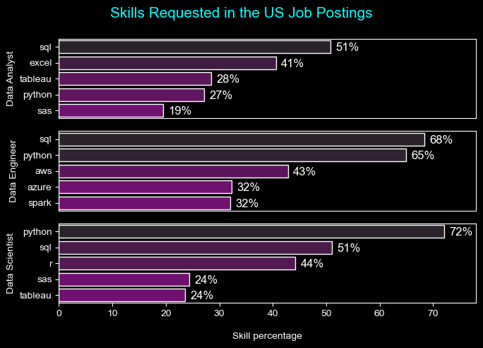

# The Analysis
Each notebook provided is aimed to look into a particular aspect of the job data market. Here is approach to the questions:
---
## 1. What are the most in-demand skills for the top three most popular data science roles?

* We first filtered out the top three data roles which has the most number of job postsings.
* Out of these top 3 roles, we filtered out the top 5 skills asked for in the job postings of each job title.

<br>
<br>


*The following code snippet shows the top three skills and their top 5 skills associated*
<br>
Here you can access my notebook for the details: [Notebook 2](Project/2_Skills_count.ipynb)
<br>
<br>

``` Python
fig, ax = plt.subplots(len(job_titles), 1, figsize=(7,5))

sns.set_theme(style='ticks')
plt.style.use('dark_background')

for i, job_title in enumerate(job_titles):
    df_plot = df_skills_pct[df_skills_pct['job_title_short'] == job_title ].head(5)
    # df_plot.plot(kind='barh', x= 'job_skills', y= 'skills_percentage', ax=ax[i], title= job_title)
    sns.barplot(data = df_plot,
                x= 'skills_percentage',
                y='job_skills',
                ax=ax[i],
                hue='skill_count', 
                palette='dark:purple_r'
                )
plt.show()
```

### Result

<br>

### Insights

- **SQL Dominance**: **SQL** is the most requested skill across all three roles (Data Analyst, Data Engineer, Data Scientist), highlighting its essential role in data management and querying across the field.

- **Role-Specific Skills**:
    - **Data Analyst**: **Excel** is notably important for **Data Analysts**, possibly for tasks involving data manipulation and reporting, with **41%** usage. Tableau, a popular data visualization tool, is also in demand, indicating the importance of visual storytelling.
    - **Data Engineer**: Python and AWS stand out as essential for Data Engineers, with **Python** at **65%** and **AWS** at **43%**, suggesting a focus on data processing and cloud infrastructure.
    - **Data Scientist**: **Python** is the leading skill for Data Scientists **(72%)**, with **R** following at **44%.** This reflects the reliance on programming for statistical analysis, machine learning, and modeling.

- **Cloud and Big Data Skills**: *AWS, Azure, and Spark* appear prominently for Data Engineers, indicating the importance of cloud computing and big data processing for this role.

- **Visualization Tools**: **Tableau** is a relevant skill for both Data Analysts and Data Scientists, showing a common need for visualizing insights.

- **Interpretation**:
    - **Data Analysts** tend to use tools that support data manipulation, reporting, and visualization.
    - **Data Engineers** require programming and cloud infrastructure skills, likely due to their focus on data pipeline development and data architecture.
    - **Data Scientists** heavily rely on programming (Python, R) to conduct advanced analytics, machine learning, and statistical analysis.

---