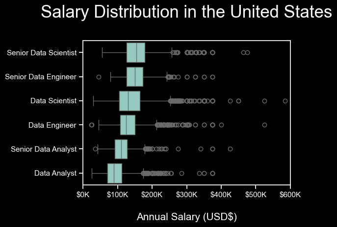
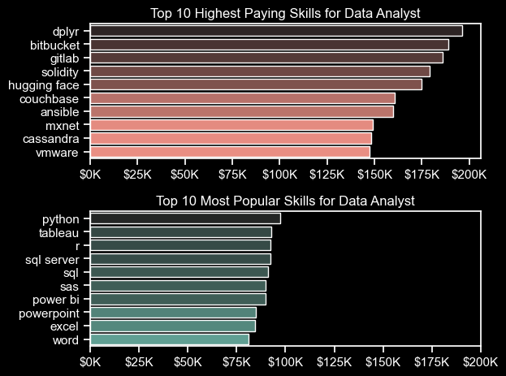

# The Analysis
Each notebook provided is aimed to look into a particular aspect of the job data market. Here is approach to the questions:
---
## 1. What are the most in-demand skills for the top three most popular data science roles?

We began by identifying the top three data roles with the highest number of job postings throughout the year. For each of these roles, we then analyzed and highlighted the top 5 skills most commonly requested in job postings, providing insight into the specific skill sets valued in each position.

<br>
<br>


*The following code snippet shows the top three skills and their top 5 skills associated*
<br>
Here you can access my notebook for the details: [Notebook-2](Project/2_Skills_count.ipynb)
<br>
<br>

``` Python
fig, ax = plt.subplots(len(job_titles), 1, figsize=(7,5))

sns.set_theme(style='ticks')
plt.style.use('dark_background')

for i, job_title in enumerate(job_titles):
    df_plot = df_skills_pct[df_skills_pct['job_title_short'] == job_title ].head(5)
    # df_plot.plot(kind='barh', x= 'job_skills', y= 'skills_percentage', ax=ax[i], title= job_title)
    sns.barplot(data = df_plot,
                x= 'skills_percentage',
                y='job_skills',
                ax=ax[i],
                hue='skill_count', 
                palette='dark:purple_r'
                )
plt.show()
```

### Result

<br>

### Insights

- **SQL Dominance**: **SQL** is the most requested skill across all three roles (Data Analyst, Data Engineer, Data Scientist), highlighting its essential role in data management and querying across the field.

- **Role-Specific Skills**:
    - **Data Analyst**: **Excel** is notably important for **Data Analysts**, possibly for tasks involving data manipulation and reporting, with **41%** usage. Tableau, a popular data visualization tool, is also in demand, indicating the importance of visual storytelling.
    - **Data Engineer**: Python and AWS stand out as essential for Data Engineers, with **Python** at **65%** and **AWS** at **43%**, suggesting a focus on data processing and cloud infrastructure.
    - **Data Scientist**: **Python** is the leading skill for Data Scientists **(72%)**, with **R** following at **44%.** This reflects the reliance on programming for statistical analysis, machine learning, and modeling.

- **Cloud and Big Data Skills**: *AWS, Azure, and Spark* appear prominently for Data Engineers, indicating the importance of cloud computing and big data processing for this role.

- **Visualization Tools**: **Tableau** is a relevant skill for both Data Analysts and Data Scientists, showing a common need for visualizing insights.

- **Interpretation**:
    - **Data Analysts** tend to use tools that support data manipulation, reporting, and visualization.
    - **Data Engineers** require programming and cloud infrastructure skills, likely due to their focus on data pipeline development and data architecture.
    - **Data Scientists** heavily rely on programming (Python, R) to conduct advanced analytics, machine learning, and statistical analysis.

<br>
<br>


# 2. How are in-demand skills trending for Data Analysts?
To identify the top trending skills for Data Analysts, we filtered job postings for Data Analyst positions and grouped them by skills and posting months. This provided us with the top 5 in-demand skills for Data Analysts throughout 2023.
<br>
<br>
*Here is the code snippet for the plot of top 5 in-demand skills for the Data Analyst*

View my notebook here for more details: [Notebook-3](Project/3_SkillsTrend.ipynb)

```Python
from matplotlib.ticker import PercentFormatter

df_plot = df_DA_US_percentage.iloc[:, :5]
sns.lineplot(data = df_plot, dashes=False, palette='tab20')
from matplotlib.ticker import PercentFormatter
ax = plt.gca()
ax.yaxis.set_major_formatter(PercentFormatter(decimals=0))

```

### Result


### Insights
<br>
Here are some insights from this graph showing the trending top skills for Data Analyst positions in the U.S. throughout 2023:

1. **SQL Dominance**: 
   - SQL remains the most sought-after skill for Data Analysts, maintaining a steady presence at the top with a likelihood of appearing in 50-55% of job postings across all months.
   - Despite minor fluctuations, SQL is consistently prioritized, highlighting its essential role in data analysis roles.

2. **Steady Demand for Excel**:
   - Excel shows a consistent demand of around 40-45% across the year. This stability indicates that Excel remains a core skill for data analysts, likely due to its versatility in data manipulation and reporting.

3. **Close Competition Between Tableau and Python**:
   - Both Tableau and Python show some monthly fluctuations, with Tableau generally being more in demand than Python.
   - This suggests that while Python is essential for data manipulation and analysis, Tableau’s visualization capabilities are frequently required, especially in job roles focused on reporting.

4. **Niche Demand for SAS**:
   - SAS maintains a steady but relatively low demand (around 20%) throughout the year, indicating that it’s a specialized skill.
   - It’s likely valued in more specific roles or industries, particularly those that rely on SAS for statistical analysis and data management.

5. **Seasonal Trends and Slight Variations**:
   - There are minor variations in the demand for Tableau and Python between July and October, suggesting a possible seasonality in the projects or hiring trends where these skills are particularly valued.
   - The overall consistency across months suggests that the required skill set for data analysts in the U.S. is fairly stable, with core skills like SQL and Excel having consistent demand and visualization or programming skills adding value based on specific job roles.

### Summary
This chart indicates that **SQL** and **Excel** are foundational skills for data analysts in the U.S., with **Tableau** and **Python** as valuable, supplementary skills. **SAS** is less commonly required but could be crucial for niche roles.
<br>
<br>

# 3. Salary Analysis for the Data Analyst
For our salary analysis of data analysts, we began by filtering the data for the United States, focusing on median salary and salary count. We then created two separate graphs: one highlighting the top-paying skills and another showcasing the most popular skills. Before diving into specific skills, we also provided an overview of the highest-paying job roles in the United States.
<br>

View my notebook here for mote details: [Notebook-4](Project/4_SalaryAnalysis.ipynb)

*Here is the code snippet for the top paying job roles visualization*
``` Python
sns.boxplot(data=df_US_top6, x='salary_year_avg', y='job_title_short', order= job_order)
ticks_x = plt.FuncFormatter(lambda y, pos: f'${int(y/1000)}K')
plt.gca().xaxis.set_major_formatter(ticks_x)
plt.show()
```
### Result


### Insights
Here are some brief insights from the salary distribution plot:

- **Senior Data Scientist** and **Senior Data Engineer** roles have the highest salary ranges, with typical salaries spanning from around $150K to $250K, and outliers extending well beyond $400K.
- **Data Scientists** and **Data Engineers** make more on average than the **Senior Data Analyst** role, with median salaries around $150K and broader distributions, highlighting the higher demand and specialization for these roles.
- **Senior Data Analyst** roles show higher salaries than **Data Analysts**, but both are generally capped below $150K.
- Overall, there is a clear progression in salary from Analyst roles to Senior and Scientist/Engineer roles, reflecting the impact of experience and specialization.
<br>
<br>

*Here is the code snippet for the visualization of top paying skills and top popular skills for Data Analyst in the US*
``` Python
fig, ax = plt.subplots(2, 1)
sns.barplot(data=df_DA_top_pay, x='median', y=df_DA_top_pay.index, ax=ax[0], hue='median', palette='dark:salmon_r' , legend=False)

sns.barplot(data=df_DA_top_popular, x='median', y=df_DA_top_popular.index, ax=ax[1], hue='median', palette='dark:#5A9_r', legend=False)


plt.tight_layout()
plt.show()
```


### Insights

Here are some insights from the visualization:

- **Highest-Paying Skills**:
  - Data analysts with specialized skills, like `dplyr`, `bitbucket`, `gitlab`, and `solidity`, command higher salaries, indicating a demand for specific technical tools.
  - Emerging technologies such as `Hugging Face` (AI/ML-focused) and `Couchbase` (database technology) are also associated with high salaries, showing an emphasis on modern data management and machine learning frameworks.

- **Most Popular Skills**:
  - Fundamental tools such as `Python`, `Tableau`, and `SQL` remain the most common skills, essential for most data analyst roles due to their versatility and broad applications in data handling and visualization.
  - Tools like `Power BI` and `Excel` indicate the need for strong data visualization and reporting capabilities, while skills like `PowerPoint` and `Word` reflect the importance of presentation and communication in data analytics roles.

- **Key Takeaways for Data Analysts**:
  - To maximize salary potential, learning niche skills like those in DevOps (`Ansible`, `GitLab`) and specialized data frameworks (e.g., `Cassandra`) could be advantageous.
  - For broader employability, proficiency in popular and versatile tools such as `Python`, `Tableau`, and `SQL` remains essential.

This analysis suggests a balance between acquiring niche skills for higher pay and maintaining proficiency in popular tools to enhance job opportunities in data analytics.


